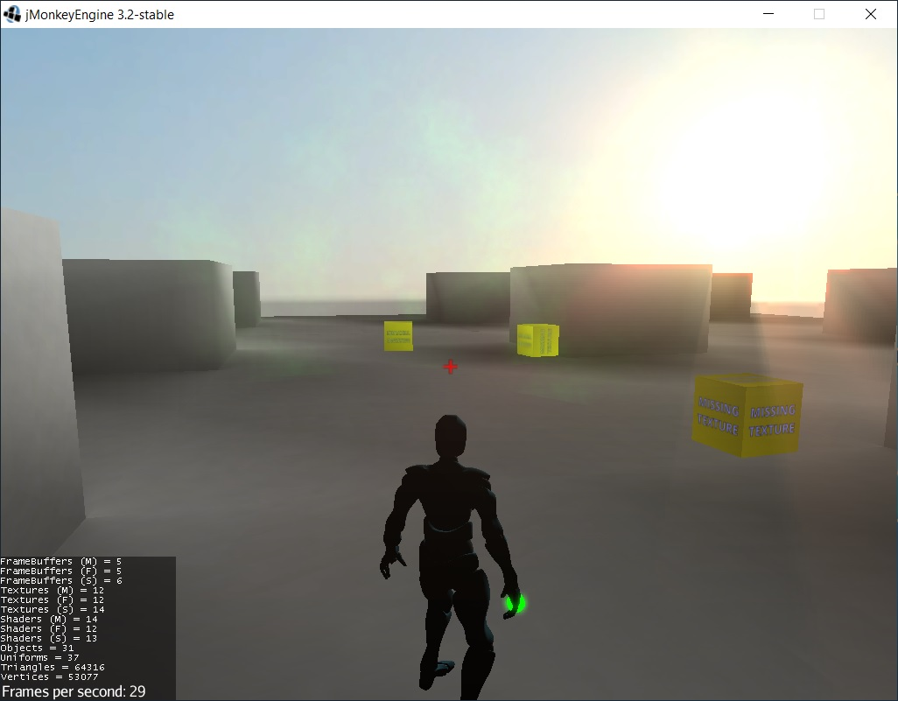

# Character-Bow-Template

A Third Person Shooter demo made with jMonkeyEngine.

The demo contains:

* Physics (with bullet engine)
* Animations (with gltf2 animations)
* Third Person Camera with Collision control
* Bow with two types of ammo and effect
* Sounds
* Particles (with org.apache.commons.pool.impl.GenericKeyedObjectPool)
* Postprocessing

