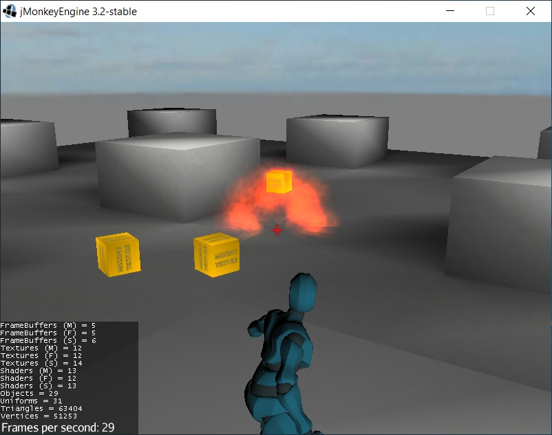
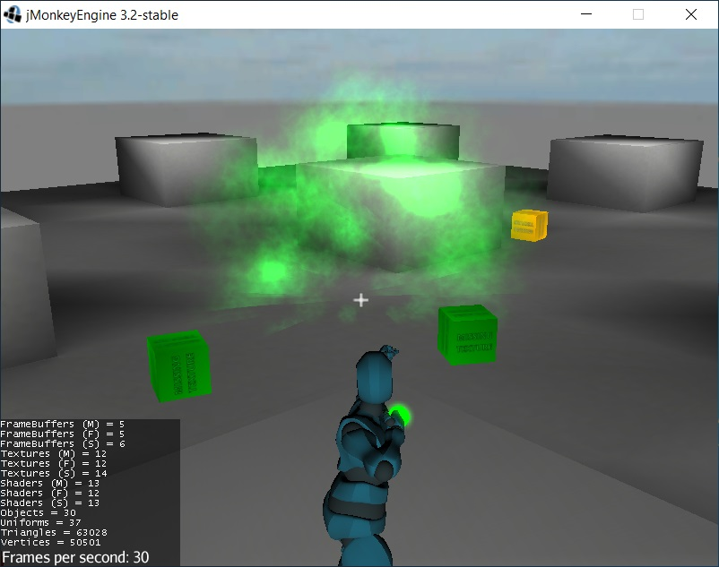
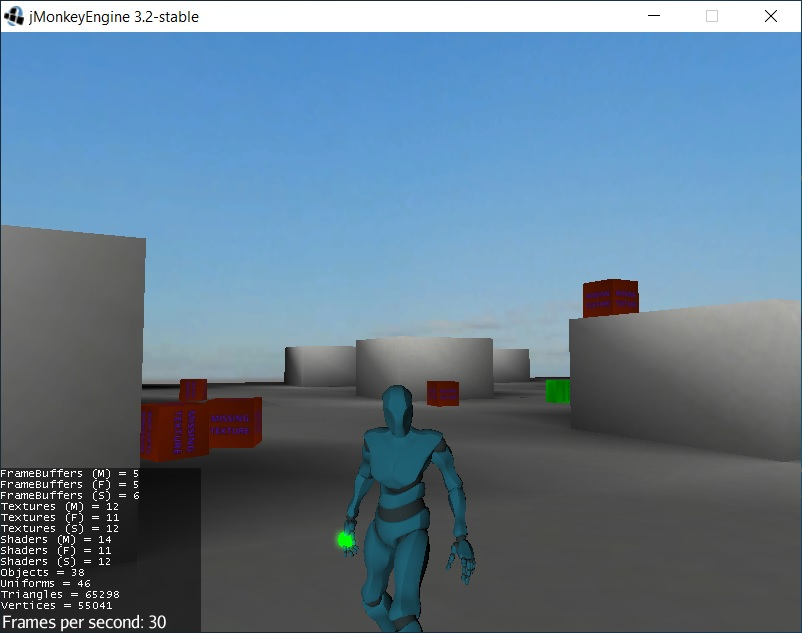

# Character-Bow-Template

A Third Person Shooter demo made with jMonkeyEngine.

The demo contains:

* Physics with [Minie](https://stephengold.github.io/Minie/minie/overview.html)
* Physics raycast to detect hit collision
* Animations (with gltf2 animations, file .blend included): 
    * "Idle", "Running", "Running_2", "Aim_Idle", "Aim_Overdraw", "Aim_Recoil", "Draw_Arrow"
* Third Person Camera with collision detection
* Bow with two types of ammo and effect
* Dynamic update of camera FOV when aiming
* Keyboard/Mouse and Joystick support
* Sounds
* Particles
* Postprocessing

# Keyboard Commands:
- WASD: Basic movements
- E: Aiming
- R: Switch arrow type
- LMB: Left Mouse Button to fire
- LSHIFT: Running
- CAMERA: Use the mouse to orient the camera
- KEY_0: Toggle Physics Debug

# Resource Used:

- Code
    - [jMonkeyEngine](https://jmonkeyengine.org/)
    - [Minie](https://stephengold.github.io/Minie/minie/overview.html)
    
- Assets
    - [Mixamo](https://www.mixamo.com/)
    - [Blender](https://www.blender.org/download/)

------

------

